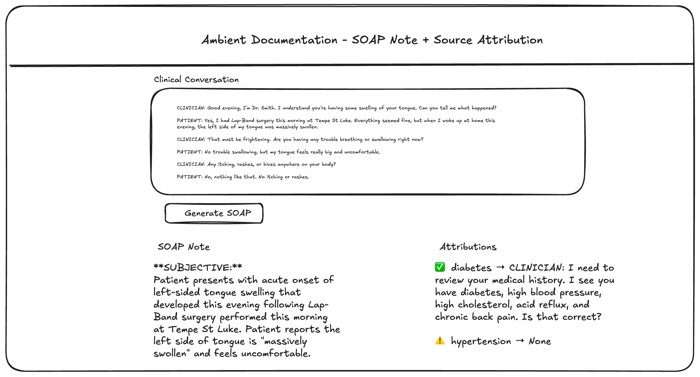

# 🩺 Ambient Documentation — AI-Powered Clinical SOAP Note Generator

> **Portfolio Project 2 of 2 | Clinical AI Series**
> Project 1 ([Medical Coding Assistant](https://github.com/nileshacharya/health-ai-portfolio/blob/main/outputs/README.md)) tackles billing accuracy. Project 2 tackles documentation speed.
> Together they demonstrate end-to-end clinical AI thinking — from encounter to reimbursement.

---

## The Problem

Clinicians spend up to **16 minutes documenting a single 30-minute patient visit** — more than 50% of visit time — on administrative tasks instead of patient care. This drives burnout, degrades care quality, and creates delays in urgent decisions.

> *"Pajama time" — after-hours charting — is now a normalized part of clinical work.*

Ambient documentation AI can change that. This project is a working prototype that demonstrates how.

---

## What This Builds

A full-stack clinical AI pipeline that:

1. **Accepts** a patient-clinician conversation (text input, simulating ambient audio capture)
2. **Generates** a structured SOAP note (Subjective, Objective, Assessment, Plan) via Claude API
3. **Attributes** every clinical claim back to a source line in the transcript
4. **Evaluates** output quality across entity accuracy, hallucination rate, omission rate, and completeness
5. **Surfaces** all of the above in a Streamlit UI

**Not just a demo — evaluation-first design.** The product ships with a built-in quality framework because clinical AI without measurable accuracy isn't safe to use.

---

## Architecture

```
MTSamples CSV (259 General Medicine cases)
        │
        ▼
[ Data Prep Script ]  ← converts raw transcriptions to conversational format (Claude API)
        │
        ▼
[ Ambient Transcript API ]  ← Python API: takes conversation → returns SOAP note + source attribution
        │           (Claude API inference)
        ▼
[ Streamlit UI ]  ← clinician selects sample, views transcript, sees evaluation metrics
        │
        ▼
[ Evaluation Layer ]
   ├── Entity extraction (scispaCy): disease / medication / symptom precision + recall
   ├── Hallucination detection: claims not grounded in source transcript
   ├── Completeness: all 4 SOAP sections present and populated
   └── Manual review rubric: would a clinician sign this note?
```

---

## Tech Stack

| Layer | Technology |
| --- | --- |
| LLM Inference | Anthropic Claude API |
| Backend | Python (plain scripts, no framework) |
| UI | Streamlit |
| Database | PostgreSQL |
| Entity Extraction | Custom keyword-based (MEDICAL_KEYWORDS — diagnoses, symptoms, medications, vitals, procedures) |
| Evaluation | Custom complexity scoring + manual review rubric |
| Data Source | MTSamples.com (General Medicine, 259 samples) |
| Output Format | SOAP (Subjective / Objective / Assessment / Plan) |

---

## How to Run

### Prerequisites
```bash
python >= 3.9
pip install -r requirements.txt
ANTHROPIC_API_KEY=your_key_here  # set in .env
```

### Setup
```bash
git clone https://github.com/YOUR_USERNAME/ambient-documentation
cd ambient-documentation
pip install -r requirements.txt
cp .env.example .env  # add your Anthropic API key
```

### Data Prep (one-time)
```bash
python scripts/data_prep.py
# Converts MTSamples General Medicine transcriptions → conversational format
# Outputs: data/conversations_general_medicine.json
```

### Generate a SOAP Note (command line)
```bash
python orchestrate_minimal.py
# Generates a SOAP note for the default conversation and prints to terminal
```

### Launch the UI
```bash
streamlit run app.py
# Opens Streamlit UI in browser
```

---

## Sample Output



**Input:** *"History and Physical for a 69-year-old male complaining of difficulty breathing for 3 days."*

**Generated SOAP Note:**

```
SUBJECTIVE:
Patient reports difficulty breathing for the past 3 days, onset gradual.
[Source: Transcript line 3]

OBJECTIVE:
Respiratory rate: 22/min. Mild accessory muscle use noted on exam.
[Source: Transcript lines 11-12, physical exam section]

ASSESSMENT:
Acute dyspnea — differential includes pneumonia vs. asthma exacerbation.
[Source: Lines 8-15, patient history + vital signs]

PLAN:
- Chest X-ray to rule out pneumonia
- Spirometry if X-ray negative
- Follow-up in 48 hours
[Source: Line 28, clinician decision section]
```

---

## Evaluation Results

> ⏳ **Batch evaluation in progress** — results from 20-sample evaluation set will be added here.
> Samples are stratified: 5 simple / 5 moderate / 5 complex / 5 rare-edge cases.

### Automated Metrics (Placeholder)

| Metric | Target | Actual |
| --- | --- | --- |
| Entity Precision (scispaCy) | > 80% | *TBD* |
| Entity Recall (scispaCy) | > 85% | *TBD* |
| Hallucination Rate | < 5% | *TBD* |
| Omission Rate | < 10% | *TBD* |
| SOAP Completeness | 100% | *TBD* |
| Source Attribution Coverage | 100% | *TBD* |

### Manual Review Results (Placeholder)

> Rubric: Does it read like a real clinical note? How many edits needed? Would you sign it?

| Sample ID | Complexity | Reads Natural? | Edits Needed | Hallucinations | Would Sign? |
| --- | --- | --- | --- | --- | --- |
| sample_001 | Simple | *TBD* | *TBD* | *TBD* | *TBD* |
| sample_002 | Simple | *TBD* | *TBD* | *TBD* | *TBD* |
| sample_003 | Simple | *TBD* | *TBD* | *TBD* | *TBD* |
| sample_004 | Simple | *TBD* | *TBD* | *TBD* | *TBD* |
| sample_005 | Simple | *TBD* | *TBD* | *TBD* | *TBD* |
| sample_006 | Moderate | *TBD* | *TBD* | *TBD* | *TBD* |
| sample_007 | Moderate | *TBD* | *TBD* | *TBD* | *TBD* |
| sample_008 | Moderate | *TBD* | *TBD* | *TBD* | *TBD* |
| sample_009 | Moderate | *TBD* | *TBD* | *TBD* | *TBD* |
| sample_010 | Moderate | *TBD* | *TBD* | *TBD* | *TBD* |
| sample_011 | Complex | *TBD* | *TBD* | *TBD* | *TBD* |
| sample_012 | Complex | *TBD* | *TBD* | *TBD* | *TBD* |
| sample_013 | Complex | *TBD* | *TBD* | *TBD* | *TBD* |
| sample_014 | Complex | *TBD* | *TBD* | *TBD* | *TBD* |
| sample_015 | Complex | *TBD* | *TBD* | *TBD* | *TBD* |
| sample_016 | Edge Case | *TBD* | *TBD* | *TBD* | *TBD* |
| sample_017 | Edge Case | *TBD* | *TBD* | *TBD* | *TBD* |
| sample_018 | Edge Case | *TBD* | *TBD* | *TBD* | *TBD* |
| sample_019 | Edge Case | *TBD* | *TBD* | *TBD* | *TBD* |
| sample_020 | Edge Case | *TBD* | *TBD* | *TBD* | *TBD* |

---

## Trade-offs & Scope Decisions

This section exists because **knowing what you didn't build — and why — is as important as what you did.**

| Decision | What I chose | What I skipped | Why |
| --- | --- | --- | --- |
| **Input modality** | Text (simulated transcript) | Audio capture + STT | Audio is mainly a UI integration problem. Text focuses the AI-PM story on inference quality and evaluation. |
| **Data source** | MTSamples.com CSV | Real EHR data | MTSamples is free, public, professionally curated. Real EHR data requires HIPAA agreements and months of access. |
| **Output format** | SOAP (hardcoded) | Configurable templates (SOAP, DAP, BIRP) | One-week prototype. SOAP is the most common format. Extensibility is a V2 decision. |
| **Evaluation depth** | scispaCy entity-level + Claude-as-judge | ROUGE/BLEU, BERTScore, clinician panel | Word-level accuracy metrics miss medical relevance. Entity-level is the right bar for clinical AI. |

---

## What's Next (V2 Thinking)

- **Audio input:** Integrate Whisper or AssemblyAI for real ambient capture
- **Specialty expansion:** Beyond General Medicine — Psychiatry (DAP notes), Orthopedics, Cardiology
- **Configurable output templates:** Let clinicians choose SOAP vs. DAP vs. H&P
- **EHR integration simulation:** Mock FHIR export to simulate downstream handoff
- **Clinician feedback loop:** Thumbs up/down on note sections → fine-tuning signal

---

## Project Context

This is **Project 2 of 2** in a clinical AI portfolio series:

| Project | Problem | Output |
| --- | --- | --- |
| [Project 1: Medical Coding Assistant](#) | Clinicians under-code or mis-code encounters → lost revenue | ICD-10 code recommendations with confidence scores |
| **Project 2: Ambient Documentation** | Clinicians spend >50% of visit time on notes → burnout | AI-generated SOAP notes with source attribution |

Together: encounter → documentation → billing. The full clinical AI value chain.

---

## About This Project

Built as an AI Product Management portfolio project to demonstrate:
- Clinical domain knowledge (documentation workflows, SOAP format, EHR context)
- AI product thinking (problem sizing, success metrics, trade-off reasoning)
- Technical execution (LLM pipelines, evaluation frameworks, full-stack prototyping)
- Evaluation-first mindset (shipping metrics alongside the model, not after)

---

*Data source: *[*MTSamples.com*](https://mtsamples.com)* — publicly available medical transcription samples.*
*Model: Anthropic Claude API*
*No real patient data was used in this project.*
